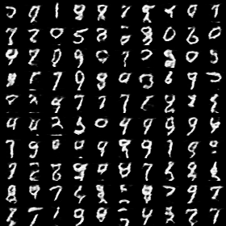
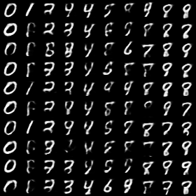

# VAE Model for Sequencial Data


## Introduction

VAE model for sequencial data, which including:
 
 - [x] VRNN network, [NIPS-2015, Chung et al. A Recurrent Latent Variable Model for Sequential Data](https://papers.nips.cc/paper/2015/file/b618c3210e934362ac261db280128c22-Paper.pdf), ( [Orignal Code](https://github.com/jych/nips2015_vrnn ))
 
 - [x] Conditional VRNN network
 - [x] 


## Requirements
- pytorch > 1.0
- cv2


## Usage

### (1) VRNN network
* train
    ```
    python train.py --opt experiments/VRNN/train-SequencialVAE-VRNN-MINIST.yaml
    ```
* generation
    ```
    python generate.py --opt experiments/VRNN/test-SequencialVAE-VRNN-MINIST.yaml
    ```

* result
    Generating results on MNIST dataset after 1000 epoches:


  	  


### (2) conditional VRNN network
* train
    ```
    python train.py --opt experiments/VRNN/train-ConditionallVAE-VRNN-MINIST.yaml 
    ```

* generation
    ```
    python generate.py --opt experiments/VRNN/test-ConditionallVAE-VRNN-MINIST.yaml 
    ```

    Generating results on MNIST dataset after 1000 epoches:


  	  